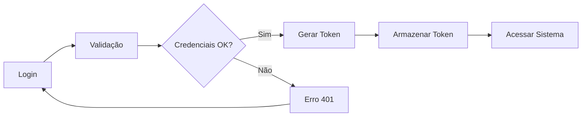

# 🎬 PAÇOCAFLIX

> **Uma plataforma de filmes moderna inspirada no Netflix, desenvolvida com Angular 13 e Spring Boot**

[](https://angular.io/)
[](https://spring.io/projects/spring-boot)
[](https://www.typescriptlang.org/)
[](https://www.oracle.com/java/)

## 📋 Sumário

- [🚀 Visão Geral](#-visão-geral)
- [✨ Funcionalidades](#-funcionalidades)
- [🛠️ Tecnologias](#-tecnologias)
- [📦 Instalação](#-instalação)
- [🎯 Como Usar](#-como-usar)
- [🎨 Design System](#-design-system)
- [🔐 Autenticação](#-autenticação)
- [📱 Responsividade](#-responsividade)
- [🧪 Testes](#-testes)
- [🤝 Contribuição](#-contribuição)

## 🚀 Visão Geral

O PAÇOCAFLIX é uma aplicação web full-stack que simula uma plataforma de streaming de filmes. O projeto combina um frontend Angular moderno com um backend Spring Boot robusto, oferecendo uma experiência de usuário similar ao Netflix.

### 🎯 Objetivos do Projeto

- Criar uma interface moderna e intuitiva para navegação de filmes
- Implementar sistema de autenticação seguro
- Integrar com APIs externas (TMDB) para dados de filmes
- Desenvolver funcionalidades de favoritos e avaliações
- Aplicar design responsivo mobile-first

## ✨ Funcionalidades

### 🔑 Autenticação e Usuários
- ✅ **Login seguro** com validação de email e senha
- ✅ **Registro de usuários** com validações avançadas
- ✅ **Gerenciamento de sessão** com JWT
- ✅ **Proteção de rotas** com AuthGuard

### 🎬 Gestão de Filmes
- ✅ **Catálogo completo** integrado com TMDB API
- ✅ **Busca avançada** por título, gênero e ano
- ✅ **Detalhes completos** com sinopse, elenco e trailers
- ✅ **Filmes populares** e em destaque
- ✅ **Filtros por gênero** dinâmicos

### ❤️ Funcionalidades Sociais
- ✅ **Sistema de favoritos** personalizado
- ✅ **Avaliações e comentários** dos usuários
- ✅ **Rating com estrelas** interativo
- ✅ **Lista pessoal** de filmes salvos

### 🎨 Interface e UX
- ✅ **Design Netflix** com paleta oficial
- ✅ **Animações suaves** e micro-interações
- ✅ **Navegação intuitiva** com scroll automático
- ✅ **Loading states** e feedback visual
- ✅ **Responsividade completa** mobile-first

## 🛠️ Tecnologias

### Frontend (Angular 13)
```typescript
├── Angular 13.3.0        // Framework principal
├── TypeScript 4.7        // Linguagem de programação
├── RxJS 7.5             // Programação reativa
├── Angular Material     // Componentes UI
├── Swiper.js           // Carrosséis interativos
└── SCSS                // Estilização avançada
```

### Backend (Spring Boot)
```java
├── Spring Boot 2.7      // Framework backend
├── Spring Security      // Autenticação e autorização
├── Spring Data JPA      // Persistência de dados
├── H2 Database         // Banco de dados em memória
├── Maven 3.8           // Gerenciamento de dependências
└── Java 11             // Linguagem de programação
```

### APIs Externas
- 🎬 **TMDB API** - The Movie Database para dados de filmes
- 🖼️ **TMDB Images** - Posters e imagens em alta qualidade

## 📦 Instalação

### Pré-requisitos
```bash
Node.js >= 16.0.0
Java >= 11
Maven >= 3.6
Git
```

### 1. Clone o Repositório
```bash
git clone https://github.com/d1g4odev/PACOCAFLIX.git
cd PACOCAFLIX
```

### 2. Configuração do Backend
```bash
cd movies-api
mvn clean install
mvn spring-boot:run
```

O backend estará rodando em: `http://localhost:8080`

### 3. Configuração do Frontend
```bash
cd movies-front
npm install
npm start
```

O frontend estará rodando em: `http://localhost:4200`

### 4. Scripts Automatizados

#### Windows (PowerShell)
```powershell
# Iniciar sistema completo
.\start-system.ps1

# Iniciar apenas frontend
.\start-frontend-only.ps1

# Parar sistema
.\stop-system.ps1

# Testes completos
.\test-system.ps1
```

## 🎯 Como Usar

### 1. **Primeiro Acesso**
1. Acesse `http://localhost:4200`
2. Clique em "Cadastre-se aqui"
3. Preencha: Nome, Email, Senha (6+ chars, letra + número)
4. Faça login com suas credenciais

### 2. **Navegação Principal**
- 🏠 **Início**: Página principal com filmes em destaque
- 🔍 **Busca**: Campo de pesquisa no topo
- 🎭 **Gêneros**: Filtros por categoria
- ❤️ **Favoritos**: Seus filmes salvos

### 3. **Funcionalidades Avançadas**
- 👤 **Menu do usuário**: Canto superior direito
- 🔍 **Debug Panel**: Botão flutuante para diagnósticos
- 📱 **Modo mobile**: Interface otimizada para celular

## 🎨 Design System

### 🎨 Paleta de Cores Netflix
```scss
$netflix-red: #e50914;        // Vermelho principal
$netflix-dark-red: #b20710;   // Vermelho escuro
$netflix-black: #000000;      // Preto absoluto
$netflix-dark-gray: #141414;  // Cinza escuro
$netflix-gray: #333333;       // Cinza médio
$netflix-light-gray: #757575; // Cinza claro
$netflix-white: #ffffff;      // Branco
```

### 📐 Tipografia Semântica
```scss
H1: 2.5rem (40px)  // Títulos principais
H2: 2rem (32px)    // Seções importantes
H3: 1.5rem (24px)  // Subtítulos
H4: 1.25rem (20px) // Títulos de cards
H5: 1.125rem (18px)// Texto destacado
H6: 1rem (16px)    // Texto padrão
```

### 📱 Breakpoints Responsivos
```scss
Mobile:  320px - 767px   // Mobile-first
Tablet:  768px - 1023px  // Tablet
Desktop: 1024px+         // Desktop e TV
```

## 🔐 Autenticação

### 🛡️ Sistema de Segurança

#### Frontend (AuthGuard)
- ✅ Proteção de rotas privadas
- ✅ Redirecionamento automático
- ✅ Verificação de tokens
- ✅ Gerenciamento de estado

#### Backend (Spring Security)
- ✅ Autenticação JWT
- ✅ Endpoints protegidos
- ✅ Validação de dados
- ✅ CORS configurado

### 🔑 Fluxo de Autenticação


## 📱 Responsividade

### 🎯 Abordagem Mobile-First

#### 📱 Mobile (320px - 767px)
- Interface otimizada para toque
- Menu hambúrguer
- Cards em coluna única
- Textos redimensionados

#### 📊 Tablet (768px - 1023px)
- Layout em 2 colunas
- Navegação horizontal
- Cards maiores
- Interações otimizadas

#### 🖥️ Desktop (1024px+)
- Layout completo
- Hover effects
- Múltiplas colunas
- Experiência premium

## 🧪 Testes

### 🔧 Scripts de Teste

#### Teste Completo do Sistema
```powershell
.\test-system.ps1
```

#### Teste da API Obrigatória
```powershell
.\test-api-obrigatoria.ps1
```

#### Teste de Avaliações
```powershell
.\test-avaliacoes.ps1
```

#### Teste de Integração TMDB
```html
# Abrir test-tmdb-integration.html no navegador
```

### 📊 Cobertura de Testes
- ✅ **Autenticação**: Login, registro, logout
- ✅ **Navegação**: Rotas protegidas, redirects
- ✅ **API**: Endpoints CRUD completos
- ✅ **UI/UX**: Responsividade, interações
- ✅ **Integração**: TMDB API, dados externos

## 🤝 Contribuição

### 🛠️ Como Contribuir

1. **Fork o projeto**
2. **Crie uma branch**: `git checkout -b feature/nova-funcionalidade`
3. **Commit suas mudanças**: `git commit -m 'feat: adiciona nova funcionalidade'`
4. **Push para a branch**: `git push origin feature/nova-funcionalidade`
5. **Abra um Pull Request**

### 📝 Padrões de Commit
```
feat: nova funcionalidade
fix: correção de bug
docs: documentação
style: formatação
refactor: refatoração
test: testes
chore: manutenção
```

### 🎯 Áreas para Contribuição
- 🎨 **UI/UX**: Melhorias de interface
- 🔧 **Performance**: Otimizações
- 🧪 **Testes**: Cobertura adicional
- 📱 **Mobile**: Experiência mobile
- 🌐 **Acessibilidade**: A11y improvements

## 📞 Contato

**Desenvolvedor**: Rodrigo Ribeiro  
**GitHub**: [@d1g4odev](https://github.com/d1g4odev)  
**Projeto**: [PAÇOCAFLIX](https://github.com/d1g4odev/PACOCAFLIX)

---

<div align="center">

### 🎬 **PAÇOCAFLIX** - *Sua próxima obsessão cinematográfica* 🍿

[](https://github.com/d1g4odev/PACOCAFLIX)
[](https://github.com/d1g4odev/PACOCAFLIX/fork)

</div> 